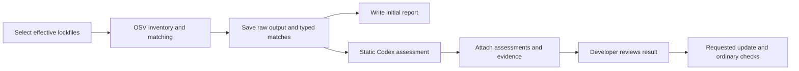

# SCA MVP design

This note records the September 30, 2026 design, building on [the research note](sca-research.md). The SDK workflow and synthetic evaluation harness are implemented. Independent corpus labeling and the developer pilot are pending; [implementation QA](sca-qa.md) records completed checks.

**Product contract.** Given a local repository using supported JavaScript/TypeScript, Python, Go, Rust, Java/Kotlin, Ruby, PHP, or .NET dependency files, return the components visible to OSV, their known advisory matches, static application assessments, and a reviewable update handoff. Keep the advisory match and application assessment separate. The initial product assists developer decisions and reports incomplete evidence explicitly.

| Decision       | MVP choice                                                                                                                                                                                                                                       |
| -------------- | ------------------------------------------------------------------------------------------------------------------------------------------------------------------------------------------------------------------------------------------------ |
| Inputs         | Supported dependency files in the selected repository, including mixed-language nested projects. See the [SDK file matrix](../sdk/typescript/docs/cli.md#dependency-assessment-sca-mvp) for exact formats and manifest limitations.              |
| npm precedence | Explicitly support and test npm-shrinkwrap precedence within the npm lockfile family. If the pinned scanner cannot attribute the effective input correctly, report that input unsupported rather than silently assessing a different resolution. |
| Scanner        | Operator-installed OSV-Scanner, initially tested against v2.6.0. Pin it in CI and examples; record the actual version.                                                                                                                           |
| Model work     | Existing inline static `triage-finding` workflow, with typed package/advisory evidence.                                                                                                                                                          |
| Entry point    | One additive SDK method, `scanDependencies(options)`, plus a runnable example and the existing plugin skill.                                                                                                                                     |
| Output         | Standalone SCA JSON, retained scanner evidence, and Markdown. Keep ordinary completed-scan storage and CLI behavior unchanged.                                                                                                                   |
| Remediation    | User-selected handoff to the existing patch workflow; verify resolution and normal project checks separately.                                                                                                                                    |
| Later work     | Full dependency graphs, general function-level reachability, containers, license policy, new-malware discovery, SBOM/VEX exports, continuous monitoring, and dashboard integration.                                                              |

The SDK adds one method:

```ts
import { createSecurity } from "@openai/codex-security";

const security = createSecurity();
try {
  const result = await security.scanDependencies({
    repositoryPath: "/work/project",
    outputDir: "/work/reports/sca", // optional; existing output rules apply
  });
  console.log(result.outputDir);
  if (result.status !== "completed") process.exitCode = 2;
} finally {
  await security.close();
}
```

Options reuse `auth`, `outputDir`, `signal`, and `maxCostUsd` semantics from existing operations. Authentication defaults to the existing configured mechanism; output defaults to a per-run SCA directory under the existing state root; omitted signal/cost limit adds no new limit. Model, provider, permissions, environment, executable handling, and user-selected Codex configuration follow existing session preparation. No new command, flag, public environment variable, scan mode, or default for existing operations is proposed.

The method runs matching first and invokes Codex only when there are advisory matches to assess. A complete zero-match result requires no model call or model authentication. It performs no dependency installation, source modification, dynamic validation, publication, or automatic dismissal. Existing `run()` and `ScanResult` retain their current meanings.

**End-to-end flow.** Use a single local operation and the current inline triage skill; no Deep Scan workers or new scheduler are needed.



1. Resolve the repository and prepare output using existing path, session, and scan-integrity helpers. Record the revision, working-tree state, selected lockfile digests, and effective OSV configuration. Enumerate repository lockfiles using the existing repository scope conventions; do not scan installed dependency trees as additional projects.
2. Select each effective supported dependency input explicitly. Preserve unsupported formats or unresolved references as coverage entries. Account for npm-shrinkwrap precedence before invoking OSV.
3. Resolve OSV through the existing executable-selection policy. Run it with argument arrays, stream its outputs to the run directory, and preserve process diagnostics.
4. Normalize complete available output and write a useful scanner-only report immediately. Its package/advisory facts are available even if model assessment later fails.
5. Supply one normalized item per component/advisory group to the existing static triage skill. Preserve every source advisory identifier and link each item to the retained evidence. Alias grouping happens in the deterministic adapter before skill invocation.
6. Validate returned IDs and the existing triage contract, attach valid assessments, and finish the report. Missing or malformed model results leave the corresponding assessment unavailable; they do not remove scanner matches.
7. Return artifact paths and explicit execution/coverage status. Update requests are separate developer actions.

**OSV integration.** v2.6.0 is the initial compatibility target, not a reason to reject every other release with a compatible documented contract. Test the pinned binary and record the version used. [Release](https://github.com/google/osv-scanner/releases/tag/v2.6.0), [compatibility policy](https://google.github.io/osv-scanner/installation/#semver-adherence)

The adapter runs one selected lockfile at a time with this argument vector:

```text
osv-scanner
scan source
--format=json
--all-packages
--no-call-analysis=all
--no-resolve
--
/absolute/path/package-lock.json
```

Positional file paths after `--` preserve literal commas. Sequential invocations avoid aggregate Windows command-line limits and make exclusion diagnostics attributable to a single lockfile. This MVP trades additional process and request overhead for straightforward source accounting. The scanner version is queried once; each invocation records its arguments, exit code, and verbatim output files. For multiple inputs, `scanner.rawOutputPath` contains aggregated source records and `scanner.argv` retains the first invocation; `scanner.invocations` records every actual call.

These are arguments to the existing upstream executable, not new Codex Security flags. Use explicit input files and platform-aware paths. `--all-packages` includes packages without reported matches; `--no-resolve` avoids manifest resolution while preserving resolved transitives already in lockfiles; call analysis is separate from this MVP's matching stage. The pinned-binary contract harness verifies these arguments against synthetic offline inputs. [Pinned flag definitions](https://github.com/google/osv-scanner/blob/v2.6.0/cmd/osv-scanner/internal/helper/flags.go), [source scanning](https://github.com/google/osv-scanner/blob/v2.6.0/docs/scan-source.md)

Normalize `results[].source`, package identity/version, reported dependency groups, full vulnerability records, and advisory alias groups. Preserve unknown upstream fields in the raw artifact. OSV JSON does not provide a complete dependency graph, direct/transitive designation, source line, or installation path. An observed component means a package tuple attributed to a source lockfile, not a claim that every installed instance was enumerated. Leave unavailable fields unknown; evidence found during triage may add a cited introduction path without turning it into scanner fact. [Pinned result types](https://github.com/google/osv-scanner/blob/v2.6.0/pkg/models/results.go)

**Respect existing OSV exclusions and show their effect.** Let upstream `osv-scanner.toml` behavior apply, preserve the relevant configuration paths/digests, and label the result as evaluated after those exclusions. Package exclusions can remove entries even with `--all-packages`; exact suppressed counts are unavailable from output. Report exclusion presence without inventing a count or an unfiltered-inventory claim. Do not silently override user settings with an empty configuration. [OSV configuration](https://google.github.io/osv-scanner/configuration/)

The restricted online scan sends package identity/version or commit data to OSV and retrieves advisory records. It requires the existing environment's network access to the service. Keep license enrichment, manifest resolution, source retrieval, and OSV remediation out of this adapter. Retain advisory records and retrieval times; a live scan does not provide an atomic historical database snapshot. [OSV API](https://google.github.io/osv.dev/api/)

**Prove failure handling before building on it.** Documented exit codes are 0 for no findings, 1 for findings, 127 for an error, and 128 for no packages. Source inspection of v2.6.0 identified diagnostics for matching failures. The pinned-binary checks reproduced missing-database and invalid-configuration failures, plus a Composer short-commit lookup skipped despite exit zero. The adapter also has a deterministic regression for inconsistent diagnostics and exit status, so that case cannot produce a complete result. Retain known error diagnostics alongside valid partial output; normal progress on stderr is not itself a failure. If the pinned diagnostic is needed to detect this upstream behavior, isolate and test it in the adapter. Do not claim compatibility with untested failure behavior. [Exit contract](https://google.github.io/osv-scanner/output/#return-codes), [pinned status handling](https://github.com/google/osv-scanner/blob/v2.6.0/pkg/osvscanner/scan.go#L542)

| Condition                                                                        | Required result                                                                                                                                    |
| -------------------------------------------------------------------------------- | -------------------------------------------------------------------------------------------------------------------------------------------------- |
| Exit 0, valid output, successful matching                                        | No matches in the effective evaluated scope; skip model assessment.                                                                                |
| Exit 1, valid output, successful matching                                        | Advisory matches are a successful scanner outcome; continue assessment.                                                                            |
| No supported lockfiles / exit 128                                                | Explicit no-input/no-package coverage outcome; never report a clean repository.                                                                    |
| Invalid lockfile, missing executable, invalid JSON, incompatible required fields | Failed or partial execution with the actual reason.                                                                                                |
| Matcher error with otherwise valid JSON                                          | Preserve inventory/matches, mark matching incomplete, and prevent a clean assertion.                                                               |
| Missing resolved package identity                                                | Preserve as unresolved/unmatched; absence of an advisory is not a negative match.                                                                  |
| Model/authentication failure                                                     | Preserve scanner evidence and mark affected assessments unavailable.                                                                               |
| User-specified model budget reached                                              | Enforce the existing limit immediately, preserve completed scanner evidence, and surface the existing budget-limit error with the output location. |
| User cancellation                                                                | Stop the process/turn via existing abort handling, preserve completed artifacts, and surface the existing interruption error with output location. |

After an output directory exists, stage failures are represented in the saved result. Return `completed`, `partial`, or `failed` for ordinary stage outcomes; invalid SDK arguments, cancellation, and user-specified budget stops retain existing exception behavior. Persist the partial result before surfacing a budget stop or interruption. A tool error is not a triage verdict.

**Data contract and persistence.** Add a distinct `codex-security.sca` document with a versioned schema. Use one source of truth for the runtime contract and generated SDK types. Reuse the existing eval triage schema by promoting it into the plugin schema area and updating references; do not maintain a second hand-copied triage contract.

| Record         | Required meaning                                                                                                                                            |
| -------------- | ----------------------------------------------------------------------------------------------------------------------------------------------------------- |
| Run            | Repository/revision context, input/config digests, scanner version/arguments, advisory retrieval provenance, model/skill version, timestamps, stage status. |
| Coverage       | Selected/effective inputs, parse/matching outcomes, unsupported or unresolved inputs, exclusions, and limitations.                                          |
| Component      | Source reference plus ecosystem/name/resolved version; reported dependency groups. Optional facts remain nullable.                                          |
| Match          | Component reference, complete advisory IDs/aliases, retained advisory references, source severity and known fixed-version information.                      |
| Assessment     | Match reference, execution state, and an optional valid `triage-finding/v0` item.                                                                           |
| Update handoff | Selected matches, cited upgrade facts, necessary unresolved decisions, and normal checks the developer should run.                                          |

Keep assessment execution state (`not_started`, `completed`, `failed`, `cancelled`) separate from verdict (`confirmed`, `not_actionable`, `needs_review`). The first says whether work ran; the second says what its evidence established. `not_actionable` must not automatically mean a technical VEX `not_affected` statement. No outcome erases the original match.

Retain `osv-output.json`, scanner diagnostics, `sca-result.json`, and `report.md` in a per-run output directory, with raw evidence preserved. Do not force raw SCA records through `scan import`: the completed findings schema requires information that scanner claims may not contain. Defer native scan-history/dashboard integration and canonical finding projection until their semantics are designed explicitly.

Use stable component keys within a source from ecosystem/name/version/source identity. Source identity for comparison is the repository-relative effective lockfile path, normalized with platform-aware helpers; retain OSV's absolute paths only as run provenance. This allows separate base/head checkout roots to correlate. Match correlation must use advisory aliases, not titles or array position. Comparison should tolerate added aliases, preserve multiple versions, and describe ambiguous correlations explicitly. For application assessment, bind results to the current source/configuration context; do not reuse earlier judgments solely because the lockfile is unchanged. No cross-run model cache is required for MVP.

**Developer workflow.** Add an SDK example under `examples/sca/` with a local runner and a CI usage example. An installed OSV executable is an explicit prerequisite; the SDK does not install it automatically.

| Step             | Developer sees or does                                                                                                                                                                              |
| ---------------- | --------------------------------------------------------------------------------------------------------------------------------------------------------------------------------------------------- |
| Run locally      | Call the example against the repository; open the report. Matching results are saved before deeper analysis starts.                                                                                 |
| Review           | See observed packages, advisory groups, assessment counts, exclusions, and incomplete coverage separately. Open the source/advisory evidence for a result.                                          |
| Compare a PR     | Run base and head in separate directories. Retain newly observed, persisting, changed-version, and no-longer-observed matches. Only complete comparable scans may claim introduction or resolution. |
| Choose an update | Select a match or group and use its handoff with the existing patch workflow. Group only when evidence identifies a shared resolving update.                                                        |
| Verify           | Re-resolve dependencies, rerun matching, and run the project's normal type/build/test checks. Report remaining versions/advisories and checks that did not run.                                     |

The report card should show package/version, source lockfile, advisory and aliases, source severity, available fixes, assessment and its scope, decisive evidence, proof gaps, and the next action. If the introduction chain is unknown, say so. An advisory fixed-version field is a candidate, not a verified compatible update.

For PR comparisons, raw matches and model assessments remain separate. Use identical captured advisory data in evaluation. Live base/head runs may observe different advisory revisions; annotate that drift and retain head-only matches as `newlyObserved` without calling them `introduced`. Incomplete rescans cannot establish introduction or close previous matches. Recorded OSV configuration also prevents those claims, even with unchanged hashes and a frozen advisory database: effective group-based exclusions can change with the lockfile. This includes configurations without exclusions because the result records configuration digests, not effective exclusion identities. Existing debt stays accessible without being presented as newly introduced on every run.

The default example is report-only for vulnerability matches. It signals incomplete execution separately and leaves CI policy decisions to the caller. No model-based merge blocking or automatic suppression is introduced. Initial CI integration writes artifacts; it does not automatically post comments, open PRs, or publish findings.

Existing `patch` accepts finding text/files and a validation-instruction file. Use a deliberate handoff for an update and ordinary compatibility checks; static triage itself does not execute them. An update is called verified only when the intended resolved version is observed and the stated checks actually pass. [Existing patch workflow](../sdk/typescript/README.md)

The adapter, SDK assessment, reports, examples, contracts, and synthetic harness are implemented. Independent corpus labeling and the developer pilot remain follow-up work.

The SDK assessment reuses the standalone operation's session setup in [api.ts](../sdk/typescript/src/api.ts), and calls the static triage skill rather than `validate()` and its separate validation semantics. Keep the orchestration and result models small; do not extend `ScanMode`, `FindingWorkflow`, Deep Scan reducers, or the findings database to accommodate raw component data.

**Evaluation is three separate tracks.** Proposed sample sizes below are pilot-design choices, not claims about existing data or proof of production error rates.

| Track                   | Initial scope                                                                                     | Purpose                                                                                                    |
| ----------------------- | ------------------------------------------------------------------------------------------------- | ---------------------------------------------------------------------------------------------------------- |
| Deterministic contracts | Approximately 30–40 compact fixture cases plus pinned-binary cases                                | Verify extraction integration, normalization, completeness, persistence, comparison, and failure behavior. |
| Static assessment       | 30 development cases; 60 held-out cases consisting of 30 affected, 15 not affected, 15 unresolved | Measure decisions and evidence across supported ecosystems, with per-language strata.                      |
| Developer/update pilot  | 5–8 developers, 15–20 paired review sessions, and 10–12 update tasks                              | Measure comprehension, review effort, and resolution/compatibility outcomes.                               |

The deterministic matrix includes per-ecosystem vulnerable/fixed fixtures, non-npm version syntax, mixed-language repositories, unsupported auxiliary-context manifests, direct/transitive declarations, multiple versions, workspaces, npm aliases and shrinkwrap precedence, pnpm peers, scoped names, optional/dev metadata, local/Git references, multiple aliases, multiple advisories, unavailable fixes, withdrawn records, and ignored packages. Add process failures, exit-0 matcher errors, malformed model output, Windows paths, cancellation, concurrent-run isolation, and base/head advisory drift. Check that a match survives every inconclusive or failed assessment.

Use synthetic frozen OSV records for ordinary adapter tests. Separately exercise the real pinned binary with synthetic lockfiles and a local test advisory database. Establish the actual offline cache layout against that binary, rather than assuming the website describes the pinned dependency's layout. Keep changing live advisory data out of the normal correctness oracle; a separate compatibility smoke check can verify connectivity.

Reuse [the existing Promptfoo calibration harness](../evals/triage-finding/promptfooconfig.calibration.yaml), pinned repository hydration patterns, and triage assertions. Add SCA-specific fixture data, `assertions/sca-evidence.js`, and `scripts/sca-result.js`. Existing citation-substring checks are insufficient: verify correspondence to the right package/version/source and have reviewers judge whether cited evidence supports the conclusion. Keep gold `unresolved` distinct from negative labels.

Compare four arms on identical captured matches: OSV report only; OSV with inspectable import/dependency-use evidence; the current unmodified triage skill; and the proposed typed SCA wrapper. The last comparison measures whether new implementation improves on what already exists. Use Go plus govulncheck as a Go-specific diagnostic; it cannot validate reachability in other languages.

Two reviewers independently label each case before seeing model results. Adjudicate disagreements or retain unresolved labels. Split by repository and advisory family, including aliases; freeze prompts before held-out evaluation. Record source/input digests, tool and model versions, advisory evidence, and settings. Repeat model runs and report counts, variation, and uncertainty. VEX-Bench can provide an additional cross-language diagnostic, but its current coverage does not substitute for the independently labeled per-language pilot. [VEX-Bench](https://arxiv.org/html/2609.08040v1)

| Metric                       | Definition                                                                                                                                     |
| ---------------------------- | ---------------------------------------------------------------------------------------------------------------------------------------------- |
| Inventory recall / precision | Correct observed component tuples divided by gold tuples / reported tuples, within the declared effective scope.                               |
| Match retention              | Correct normalized matches divided by supplied scanner matches; alias grouping cannot lose source occurrences.                                 |
| Matching correctness         | Agreement with independently adjudicated advisory fixtures, not merely agreement with OSV itself.                                              |
| Affected confirmation recall | Correctly confirmed affected cases divided by all affected cases; unknowns and execution failures remain in the denominator.                   |
| Incorrect dismissal rate     | Affected cases labeled not actionable divided by all affected cases.                                                                           |
| Dismissal precision          | Correct supported not-affected conclusions divided by all not-actionable conclusions; unsupported dismissal of an unresolved case is an error. |
| Uncertainty handling         | Correct `needs_review` on unresolved gold divided by unresolved cases; separately count unjustified decisive judgments.                        |
| Decision coverage            | Valid decisive judgments divided by attempted cases, reported alongside their accuracy.                                                        |
| Evidence quality             | Reviewer-supported decisive conclusions divided by decisive conclusions, with mechanical citation checks as a separate measure.                |
| Update success               | Tasks that produce the intended resolved-version change and pass the stated checks divided by attempted update tasks.                          |
| Developer value              | Paired review time, comprehension, corrections/reopens, completion rate, latency, and cost.                                                    |

Report a three-class confusion matrix plus execution errors. High decision accuracy with almost no decisions is not sufficient; neither is high confirmation precision with poor affected-case recall. A project-level cluster of similar cases should not be counted as many independent assurances.

**Launch gates.** All deterministic behavior above must pass. All observed scanner matches must survive normalization and remain accessible regardless of model outcome. Every supported input must have a visible coverage result. No unresolved reproducible high-impact assessment error may remain in the reviewed pilot. Incomplete execution cannot be labeled clean or used to close a prior match. An update is verified only after recorded resolution and prescribed checks succeed.

Provisional learning targets are at least 90% confirmation precision and at least 20% lower paired median review time than the scanner-only workflow, while reporting recall, decision coverage, latency, and cost. Revisit these targets after measuring the baseline. They are not achieved results. Even zero incorrect dismissals among 30 affected cases gives only an approximately 9.5% one-sided 95% upper error bound; this pilot cannot justify automatic dismissal.

Before submitting implementation changes, run focused tests and the SDK package checks required by [SDK AGENTS](../sdk/typescript/AGENTS.md). Any plugin/schema changes also require all five portable checks from [root AGENTS](../AGENTS.md): Ruff lint, Ruff format check, TypeScript `build:ci`, plugin source compatibility, and its Node test suite. Test inherited runtime settings at the process boundary; if shared runtime behavior changes, include discovery, reducer, and resumed Deep Scan workers. Observed implementation checks are recorded separately in [implementation QA](sca-qa.md).
