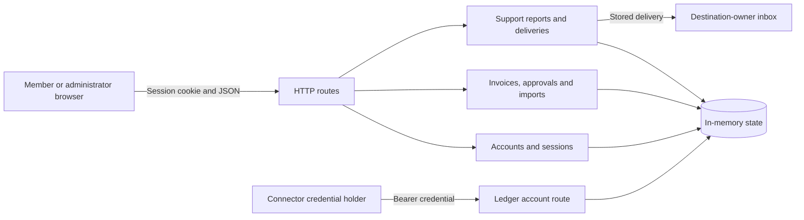

# Invoice Desk threat model

Generated with Codex Security CLI 0.1.30 (`policy`, OpenAI `gpt-5.6-sol`, high
effort), then reviewed against the source and condensed. The CLI inspected a
standalone copy of `app/`. The local QA scope and intended properties below also
use the surrounding [sample guide](README.md) and [QA guide](qa/README.md).

Invoice Desk is deliberately insecure. This document describes its architecture
and intended security boundaries; it does not claim that those boundaries hold.
Threat modeling is separate from finding discovery and runtime verification.
Keep this file outside the standalone application given to blind scans.

## 1. Overview

Invoice Desk manages workspace invoices, imports, approvals, notes, and accounting
connections through server-rendered pages and a JSON API. Members work with their
workspace's invoices and edit their display name. Administrators additionally
approve invoices and manage import policy. An approval represents the invoice
version reviewed. See the [application contract](app/README.md#workspaces).

The documented startup runs a dependency-free Node.js process on
`127.0.0.1:4310`, with `PORT` selecting another local port. Each application
instance creates fresh in-memory users, sessions, invoices, policies, previews,
connector credentials, and deliveries. Restarting discards that state.
[Startup](app/server.mjs#L269), [store](app/store.mjs#L8).

All server components and connector adapters run in the same process. Deliveries
record invoice summaries in memory; the app makes no outbound network requests,
transfers no money, and writes no application state to disk. Ledger exposes a
synthetic settlement balance to a caller with the matching connector credential.
[Integration implementation](app/integrations.mjs#L26).

## 2. Actors, assets, and trust boundaries

| Actor                   | Intended authority                                                                                                                               |
| ----------------------- | ------------------------------------------------------------------------------------------------------------------------------------------------ |
| Unauthenticated caller  | Reach login, health, and static assets. Application operations require a session or the separate Ledger bearer credential.                       |
| Workspace member        | Work with invoices in their own workspace, submit imports and notes, and edit their display name.                                                |
| Workspace administrator | Member actions plus approval and import-policy changes, scoped to their own workspace.                                                           |
| Destination owner       | Inspect invoice copies delivered to their destination; this does not grant authority over the source workspace's Ledger account.                 |
| Connector caller        | Read the Ledger account associated with its bearer credential. This does not grant a browser session or administrator role.                      |
| Local operator          | Start and stop the process and control its host. Host access is trusted; application authorization does not isolate data from the process owner. |

The assets are:

- Password records, session tokens, workspace membership, and administrator roles.
- Invoice contents, versions, approvals, notes, and workflow state.
- Workspace import policies and the integrity of import review.
- Connector credentials, settlement balances, diagnostic exports, and destination
  inbox contents.
- Availability and integrity of the single process and its volatile state.

HTTP clients can send arbitrary JSON to reachable routes, independently of what
the interface offers. Each workspace is a separate authorization domain even
though all records share one process. Shared caches and nested policy objects
must preserve that separation. A workspace administrator has no authority over
another workspace. User-supplied notes also cross a boundary when another user's
browser interprets the resulting page.

Connector credentials carry authority beyond the ordinary invoice view. A
diagnostic download or an invoice copy must not transfer that authority to its
recipient. The Ledger bearer route has a separate authentication path from the
session-protected application. [Route boundaries](app/server.mjs#L92),
[Ledger authentication](app/integrations.mjs#L53).

### Controls already present

Passwords use salted scrypt records and timing-safe comparison. Sessions use
random tokens, expire after eight hours, and are removed on logout or when an
expired session is checked. Cookies use `HttpOnly` and `SameSite=Strict`.
[Password records](app/store.mjs#L3), [sessions](app/accounts.mjs#L12),
[cookie settings](app/server.mjs#L100).

The router applies a common session gate after its public and bearer-authenticated
routes. Invoice lists and most invoice operations check workspace ownership;
approval and import-policy updates check the administrator role. These checks
are useful controls, but their coverage and the integrity of the values they
trust require separate review. [Ownership and roles](app/invoices.mjs#L10),
[import policy](app/imports.mjs#L12).

JSON writes require a JSON object, amounts receive positive-integer validation,
and responses use `Cache-Control: no-store` and `X-Content-Type-Options: nosniff`.
The rendering code has an HTML-escaping helper, and browser notices and previews
use `textContent`. An escaping helper protects only values passed through it.
[Request parsing](app/server.mjs#L54), [rendering](app/views.mjs#L1),
[browser updates](app/public/client.js#L43).

## 3. Threat scenarios and intended protections

These are review scenarios and repair directions for a secure implementation.
The sample deliberately retains the seeded weaknesses for QA. The
[expected-findings manifest](qa/expected-findings.json) identifies the ten root
causes; the [HTTP harness](qa/app.test.mjs) records the behaviors it checks.
Neither this model nor the number of rows establishes a scanner's detection score.

| Boundary and potential failure                                                                      | Intended protection                                                                                                                             | Source to review                                                                          |
| --------------------------------------------------------------------------------------------------- | ----------------------------------------------------------------------------------------------------------------------------------------------- | ----------------------------------------------------------------------------------------- |
| Member to connector authority: a diagnostic export discloses a reusable credential.                 | Export only diagnostic fields that the recipient is allowed to see; keep connector secrets server-side.                                         | [Support report](app/integrations.mjs#L16)                                                |
| Workspace to workspace: an invoice read returns a record without checking its owner.                | Apply workspace authorization to every object read as well as writes.                                                                           | [Individual invoice route](app/server.mjs#L227), [ownership helper](app/invoices.mjs#L21) |
| Workspace to shared cache: a valid preview request receives another workspace's cached content.     | Cache identity must include the workspace and invoice identity, with versioning for invalidation.                                               | [Preview cache](app/invoices.mjs#L71)                                                     |
| Reviewed version to sent version: editing leaves an old approval effective.                         | Sending requires approval of the current invoice version; edits invalidate or supersede earlier approval.                                       | [Edit, approve, and send](app/invoices.mjs#L34)                                           |
| Import input to review decision: unsupported or failed review permits an over-limit import.         | Required review fails closed; unsupported schemas and reviewer errors cannot imply approval.                                                    | [Import review](app/imports.mjs#L35)                                                      |
| Source workspace to destination owner: an invoice copy carries the source connector's authority.    | Keep authentication credentials separate from recipient-visible delivery data and bind any connector authorization to its intended destination. | [Delivery and inbox](app/integrations.mjs#L26)                                            |
| Workspace to shared policy state: one administrator changes another workspace's import limit.       | Each workspace owns independent mutable policy state, including nested objects.                                                                 | [Policy construction](app/store.mjs#L8), [policy update](app/imports.mjs#L12)             |
| Validated document to persisted record: authorization and storage use different workspace metadata. | Derive stored ownership from the authenticated workspace and reject conflicting ownership fields.                                               | [Import authorization](app/imports.mjs#L21), [stored ownership](app/imports.mjs#L50)      |
| Member to administrator: a self-service profile edit changes authorization attributes.              | Allow only intended profile fields to change and keep role assignment outside self-service profile updates.                                     | [Profile update](app/accounts.mjs#L49), [role check](app/invoices.mjs#L10)                |
| Stored note to another user's browser: note content becomes active HTML.                            | Encode note content for its rendering context; if formatting is supported, use an explicit safe formatting policy.                              | [Comments](app/invoices.mjs#L84), [invoice rendering](app/views.mjs#L71)                  |

Availability also needs review beyond those ten cases. The parser buffers a
complete request body, login performs synchronous password derivation, and the
store has no application-defined collection limits. Assess the caller's reach
and the resource consumed before assigning impact; this model sets no arbitrary
request or rate thresholds. [Body buffering](app/server.mjs#L54),
[password verification](app/accounts.mjs#L12), [collections](app/store.mjs#L99).

## 4. Assumptions, impact, and verification

The supported sample use is local QA with synthetic data and credentials. Fixed
login accounts are fixture setup; connector credentials are fresh per process
and valid only for that process's adapter. The intended role, workspace, approval,
and credential boundaries still matter when evaluating a scenario.

Severity depends on the starting principal, the boundary crossed, the additional
authority obtained, affected data, and repeatability. Distinguish a disclosure
within one workspace from a cross-workspace disclosure, and a metadata leak from
a usable credential. Browser impact depends on what executes and whose authority
it gains. The harness checks inert HTML interpretation; it does not by itself
establish script execution or administrator compromise.

Do not infer real financial loss, external-account compromise, or host execution
from an in-process simulation. The generated model does not assign final
severities or validate findings. Review unexpected scanner findings and duplicate
root causes separately, using the [QA scoring guidance](qa/README.md#scanner-evaluation).

The direct executable binds to loopback, but the exported `createApp()` returns
an unbound server. Remote exposure, reverse proxies, TLS, persistent storage, and
multiple processes would change this model; none is a supported deployment for
this sample. The current cookie and in-memory design are not a production
deployment contract. [Server construction](app/server.mjs#L86),
[listener](app/server.mjs#L269).

Revisit this model when routes, ownership rules, approval transitions, credential
recipients, rendering, or storage change. Run the harness to preserve the QA
contract, and keep this document and the answer key outside discovery inputs.
For actual Codex Security product vulnerabilities, follow the repository's
[security reporting policy](../../SECURITY.md).
